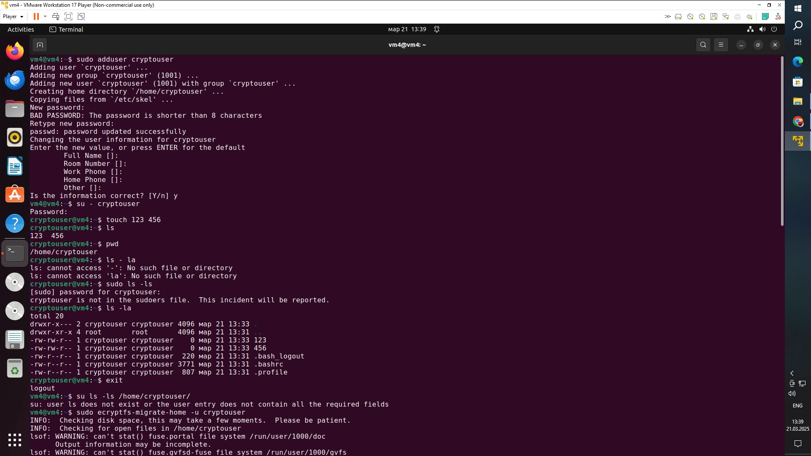

# Задание 1
Установите eCryptfs.
Добавьте пользователя cryptouser.
Зашифруйте домашний каталог пользователя с помощью eCryptfs.
В качестве ответа пришлите снимки экрана домашнего каталога пользователя с исходными и зашифрованными данными.

## ОТВЕТ:

# Задание 2
Установите поддержку LUKS.
Создайте небольшой раздел, например, 100 Мб.
Зашифруйте созданный раздел с помощью LUKS.
В качестве ответа пришлите снимки экрана с поэтапным выполнением задания.

## ОТВЕТ:

Шифровать разделы sda1, sda2, sda3 нельзя, так как это может привести к сбоям работы системы.

 
